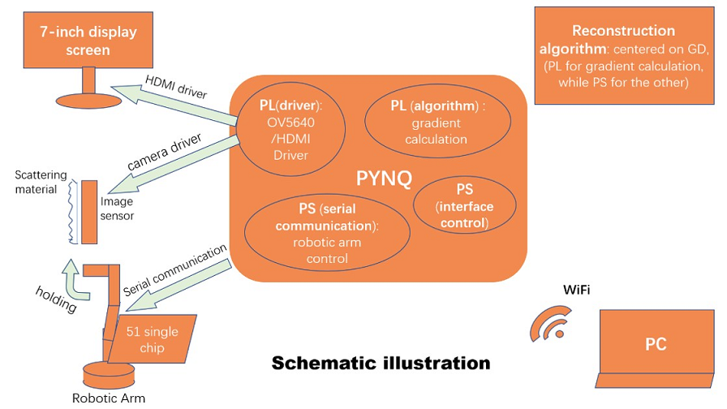

# CC-Cam: A diffuser camera based on Pynq-Z2

This repository contains the design of our computational imaging system *CC-Cam*.  
With a scattering media in front of the imaging sensor, this lensless camera reconstructs the images of real scenes by scattering imaging technology. We use Xilinx PYNQ-Z2 to build a compact system with the integration of PSF calibration, raw image capture, reconstruction acceleration and user interaction.   

In the work pipeline, first the PSF (point spread function) should be obtained during the calibration of a point light source, then the FISTA algorithm is implemented on the scattered image captured by the sensor, and the reconstruction result is derived after the iterative computation.  
Details of the reconstruction alogorithm can be found here:  
*DiffuserCam*: https://waller-lab.github.io/DiffuserCam/tutorial.html

In the PL(Programmable logic), we build the basic video flow from sensor to displayer and  use HLS(High level synthesis) to design the IP core for gradient calculation in the reconstruction algorithm, since gradient calculation involves heavy computing cost. The increase of the degree of computing parallelism by using the IP core accelerates the reconstruction task.  

By running a ipython notebook, the PS(Processing System) manages the overall system control, such as the interactive interface, the motion of robotic arm holding the camera, the remote connection, the preprocessing of images. Buttons and switches on the boards and display screen can be used to operate the system.  

Imaging technologies fully utilizing the effect of scattering can realize imaging through scattering media or other complex media and have super resolution characteristics. But scattering imaging technology, as one of the typical research fields of computational imaging, has the characteristics of heavy computing cost, which results that the present imaging algorithms can hardly be applied on embedded computers. Our work demonstrates a possible solution with the aid of FPGAs. The similar system structure can be extended to other applications that combines the computational imaging algorithm and the customizable computing design.  

## Folder Structure
* PL_design
	+ hls_sp: HLS design files of two IP cores, including gradient computation and float-fixed point transition
	+ py2hls_test_tools: test scripts to compare the simulation resuts from the HLS design with the algorithm prototype written in Python  
	+ vivado_sys: hardware design in Vivado, including HDMI display and the camera's driver
* PS_design
	+ pynq_host: host files on PYNQ written in jupyter notebook  and some modifications on PYNQ's Linux system configuraion
	+ lobot_arm_51：C51 codes for the driving board(not the PYNQ board)of the [LeArm](https://www.lobot-robot.com/p_detail/18.html) robot arm    

## Environment for this project
1. Vivado `2018.3` 
2. Pynq-Z2 board with `image v2.3` 
3. Python3.6 (on your PC)： 
	- opencv-python 3.4.3.18 
	- numpy 1.16.4  
	- matplotlib 3.1.1  
	- Pillow 5.4.1 
	- ipywidgets 7.4.2 
4. A web browser (eg. Chrome) or IDE supporting `Jupyter Notebook` 
5. Additional Python3.6 packages to be installed on your PYNQ： 
	- pyserial 
	- ipywidgets 
6. (Optional)Keil uVision 4(or 5) only for the C51 code of the robot arm  

---
Some annotations are written in Chinese, which may cause unreadable code in your editors.
